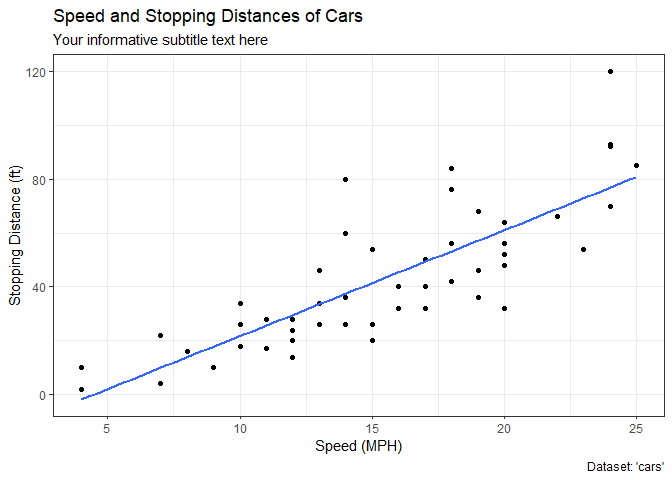
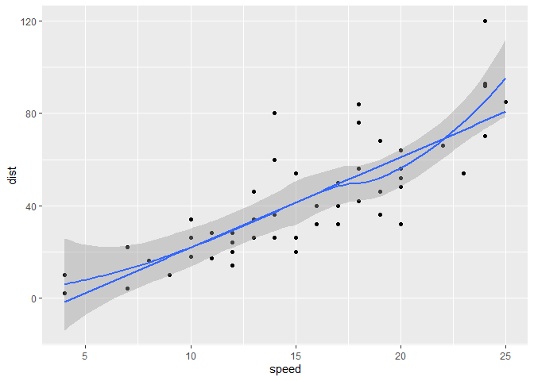
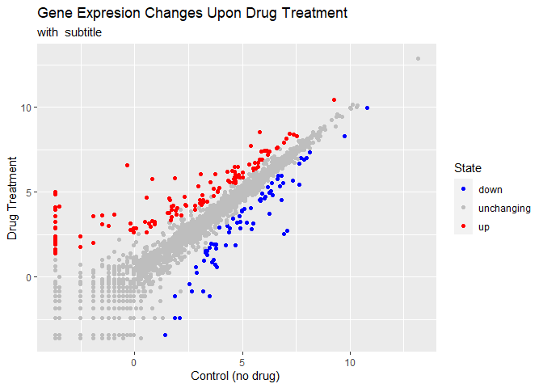
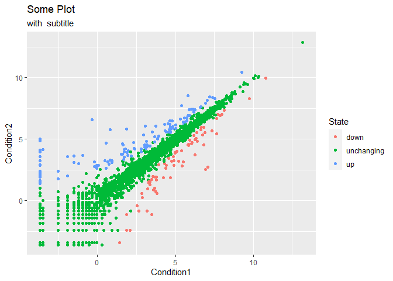
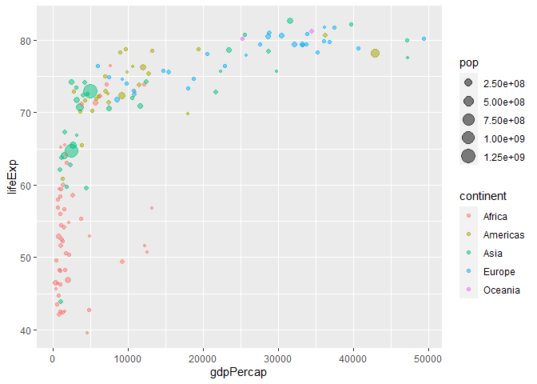
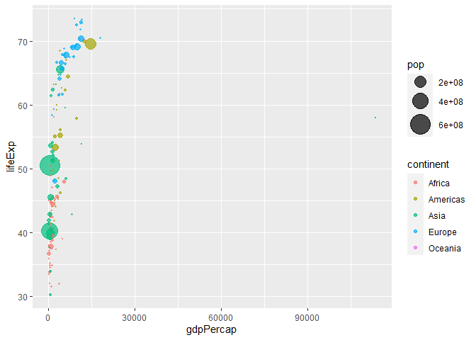
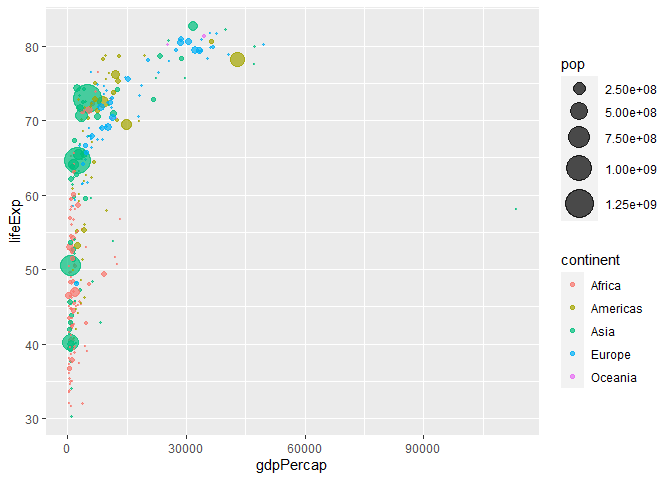

Class 5: Data Visualization
================
Christina

# Plotting in R

R has multiple plotting and graphics systems. The most population of
which is **ggplot2**

We have already played with “base” R graphics, This comes along with R
“out of the box”.

``` r
plot(cars)
```


Compared to base R plots, ggplot is much more verbose - you need to
write more code to get simple plots like the one above.

To use ggplot, I ened to first install the ggplot2 package. To install
any package in R, I use the `install.package()` command (in the console)
along with the package name.

The install is a one time only requirement. The pckage is now o our
computer. I don’t need to re-install it.

However, I can’t just use it without loading it up with a `library()`
call.

``` r
# install.packages("ggplot2")
library(ggplot2)
```

``` r
ggplot(cars)
```


All ggplot figures need at lest 3 things: -data(this is the data.frame
with our numbers) -aesthetics (“aes”, how our datamaps to the plot, what
is in the x and y axis, what the points look like, etc.) -geoms (do you
want lines, points, columns, etc.)

``` r
ggplot(data=cars) + 
  aes(x=speed, y=dist) +
  geom_point()
```


I want a trend line to show the relationship between the dist and speed

``` r
ggplot(cars) + 
  aes(x=speed, y=dist) +
  geom_point() +
  labs(title="Speed and Stopping Distances of Cars",
       x="Speed (MPH)", 
       y="Stopping Distance (ft)",
       subtitle = "Your informative subtitle text here",
       caption="Dataset: 'cars'") +
  geom_smooth(method="lm", se=FALSE) +
  theme_bw()
```

    `geom_smooth()` using formula = 'y ~ x'



``` r
ggplot(data=cars) + 
  aes(x=speed, y=dist) +
  geom_point() +
  geom_line()
```


This is not what we want, we want a trend line.

``` r
bb <-ggplot(data=cars) + 
  aes(x=speed, y=dist) +
  geom_point() +
  geom_smooth()
```

``` r
bb+geom_smooth(method = "lm", se=FALSE)
```

    `geom_smooth()` using method = 'loess' and formula = 'y ~ x'
    `geom_smooth()` using formula = 'y ~ x'



``` r
bb
```

    `geom_smooth()` using method = 'loess' and formula = 'y ~ x'


``` r
url <- "https://bioboot.github.io/bimm143_S20/class-material/up_down_expression.txt"
genes <- read.delim(url)
head(genes)
```

            Gene Condition1 Condition2      State
    1      A4GNT -3.6808610 -3.4401355 unchanging
    2       AAAS  4.5479580  4.3864126 unchanging
    3      AASDH  3.7190695  3.4787276 unchanging
    4       AATF  5.0784720  5.0151916 unchanging
    5       AATK  0.4711421  0.5598642 unchanging
    6 AB015752.4 -3.6808610 -3.5921390 unchanging

``` r
nrow(genes)
```

    [1] 5196

``` r
colnames(genes)
```

    [1] "Gene"       "Condition1" "Condition2" "State"     

``` r
ncol(genes)
```

    [1] 4

``` r
table(genes["State"])
```

    State
          down unchanging         up 
            72       4997        127 

``` r
round( table(genes$State)/nrow(genes) * 100, 2 )
```


          down unchanging         up 
          1.39      96.17       2.44 

The ‘head()’ function will print out just the first few rows (by 6)

``` r
head(genes)
```

            Gene Condition1 Condition2      State
    1      A4GNT -3.6808610 -3.4401355 unchanging
    2       AAAS  4.5479580  4.3864126 unchanging
    3      AASDH  3.7190695  3.4787276 unchanging
    4       AATF  5.0784720  5.0151916 unchanging
    5       AATK  0.4711421  0.5598642 unchanging
    6 AB015752.4 -3.6808610 -3.5921390 unchanging

``` r
table(genes$State)
```


          down unchanging         up 
            72       4997        127 

``` r
p <- ggplot(genes) +
  aes(Condition1, Condition2, color=State) +
  geom_point() +
  labs(title = "Some Plot", 
       subtitle = "with  subtitle")

p + scale_colour_manual(values=c("blue","gray","red")) +
    labs(title="Gene Expresion Changes Upon Drug Treatment",
         x="Control (no drug) ",
         y="Drug Treatment")
```



``` r
p
```



I want **bold** and *italics*

``` r
#install.packages("gapminder")
library(gapminder)
# File location online
url <- "https://raw.githubusercontent.com/jennybc/gapminder/master/inst/extdata/gapminder.tsv"

gapminder <- read.delim(url)
```

``` r
#install.packages("dplyr")
library(dplyr)
```


    Attaching package: 'dplyr'

    The following objects are masked from 'package:stats':

        filter, lag

    The following objects are masked from 'package:base':

        intersect, setdiff, setequal, union

``` r
gapminder_2007 <- gapminder %>% filter(year==2007)
```

``` r
ggplot(gapminder_2007) +
  aes(x=gdpPercap, y=lifeExp, color=continent, size=pop) +
  geom_point(alpha=0.5)
```



``` r
ggplot(gapminder_2007) +
  aes(x=gdpPercap, y=lifeExp,color=pop) +
  geom_point(alpha=0.8)
```


``` r
ggplot(gapminder_2007) +
  aes(x=gdpPercap, y=lifeExp,size=pop) +
  geom_point(alpha=0.5)
```


``` r
ggplot(gapminder_2007) + 
  geom_point(aes(x =gdpPercap, y = lifeExp,size = pop), alpha=0.5) + 
  scale_size_area(max_size = 10)
```


``` r
gapminder_1957 <- gapminder %>% filter(year==1957)
ggplot(gapminder_1957) + 
  aes(x = gdpPercap, y = lifeExp, color=continent,
                 size = pop) +
  geom_point(alpha=0.7) + 
  scale_size_area(max_size = 10) 
```



``` r
gapminder_1957 <- gapminder %>% filter(year==1957| year==2007)
ggplot(gapminder_1957) + 
  aes(x = gdpPercap, y = lifeExp, color=continent,
                 size = pop) +
  geom_point(alpha=0.7) + 
  scale_size_area(max_size = 10) 
```



``` r
facet_wrap(~year)
```

    <ggproto object: Class FacetWrap, Facet, gg>
        compute_layout: function
        draw_back: function
        draw_front: function
        draw_labels: function
        draw_panels: function
        finish_data: function
        init_scales: function
        map_data: function
        params: list
        setup_data: function
        setup_params: function
        shrink: TRUE
        train_scales: function
        vars: function
        super:  <ggproto object: Class FacetWrap, Facet, gg>
