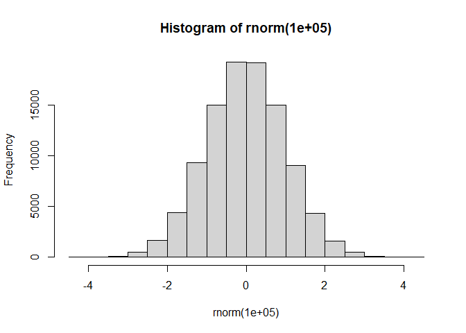
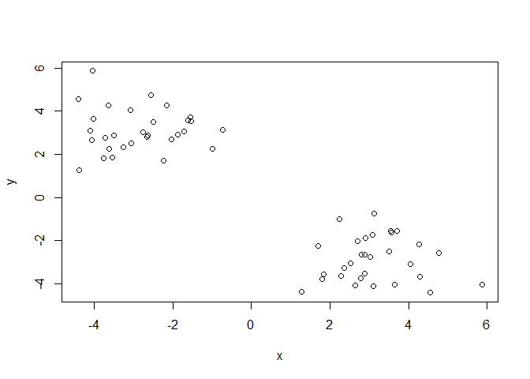
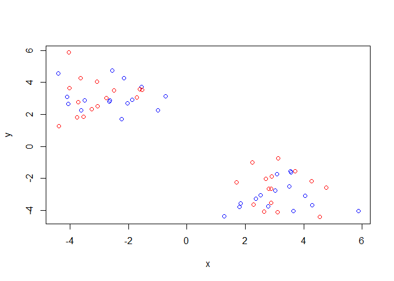
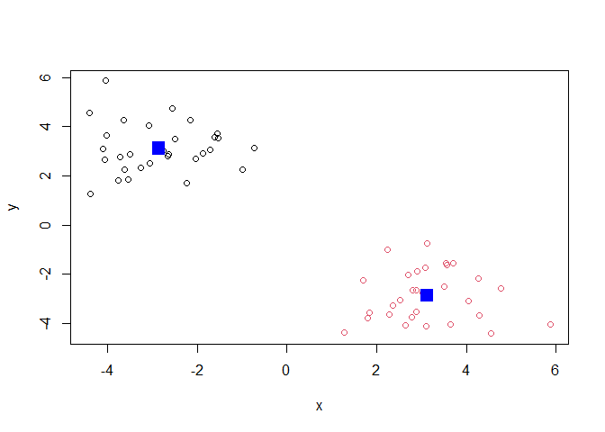
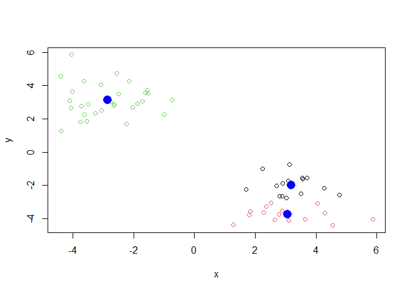
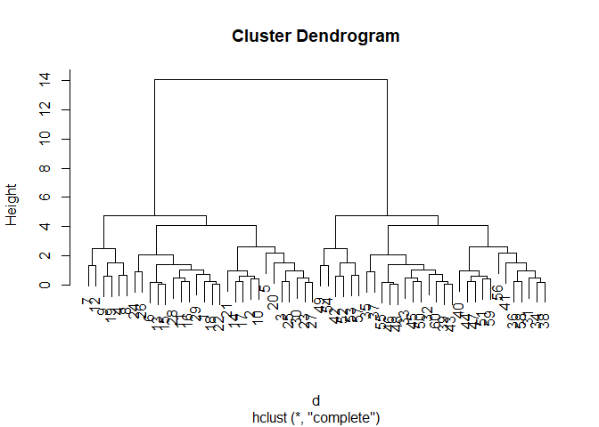
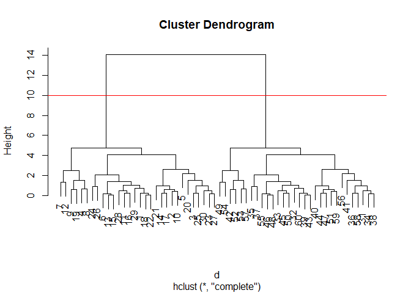
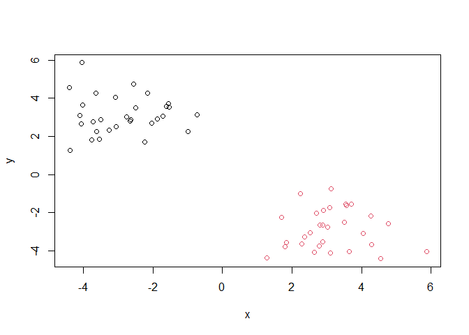

class07
================
Christina Mac

In this class, we will explore clustering and dimensionality reduction
methods.

\##K-means Make up some input data where we know what the answer should
be.

``` r
#will give 10 random values around 0
rnorm(10)
```

     [1] -0.268414612  1.029385799  0.566046888 -0.417968562  1.400267274
     [6]  1.340637315  0.082269026  0.724728222  0.004364337  2.435245876

``` r
#give the histogram for the random numbers
hist(rnorm(100000))
```



``` r
#the default mean is 0, you can change that
#making a vector
temp <-c(rnorm(30,-3), rnorm(30,+3))
#reverse --> will switch the two vectors in temp
x<-cbind(x=temp, y=rev(temp))
x
```

                   x          y
     [1,] -2.7648050  3.0132336
     [2,] -4.1095182  3.0988412
     [3,] -3.2647907  2.3520979
     [4,] -2.5599963  4.7608755
     [5,] -4.3751551  1.2846220
     [6,] -1.5532134  3.7100969
     [7,] -4.0472759  5.8663778
     [8,] -2.1491853  4.2592455
     [9,] -3.0746939  4.0401914
    [10,] -4.0560668  2.6491078
    [11,] -1.7111166  3.0771183
    [12,] -4.4087885  4.5556389
    [13,] -1.5246883  3.5453440
    [14,] -3.5029848  2.8846729
    [15,] -1.6100962  3.5624785
    [16,] -1.8755732  2.9106239
    [17,] -3.7224846  2.7766816
    [18,] -2.6387230  2.8916591
    [19,] -3.6487878  4.2802045
    [20,] -2.2268930  1.6961524
    [21,] -4.0297867  3.6360777
    [22,] -2.6529394  2.7988868
    [23,] -3.7602126  1.8049282
    [24,] -0.7201912  3.1267967
    [25,] -3.0596876  2.5210814
    [26,] -0.9892118  2.2439178
    [27,] -3.5436171  1.8423456
    [28,] -2.0311301  2.6972646
    [29,] -2.4896341  3.5136631
    [30,] -3.6112357  2.2783263
    [31,]  2.2783263 -3.6112357
    [32,]  3.5136631 -2.4896341
    [33,]  2.6972646 -2.0311301
    [34,]  1.8423456 -3.5436171
    [35,]  2.2439178 -0.9892118
    [36,]  2.5210814 -3.0596876
    [37,]  3.1267967 -0.7201912
    [38,]  1.8049282 -3.7602126
    [39,]  2.7988868 -2.6529394
    [40,]  3.6360777 -4.0297867
    [41,]  1.6961524 -2.2268930
    [42,]  4.2802045 -3.6487878
    [43,]  2.8916591 -2.6387230
    [44,]  2.7766816 -3.7224846
    [45,]  2.9106239 -1.8755732
    [46,]  3.5624785 -1.6100962
    [47,]  2.8846729 -3.5029848
    [48,]  3.5453440 -1.5246883
    [49,]  4.5556389 -4.4087885
    [50,]  3.0771183 -1.7111166
    [51,]  2.6491078 -4.0560668
    [52,]  4.0401914 -3.0746939
    [53,]  4.2592455 -2.1491853
    [54,]  5.8663778 -4.0472759
    [55,]  3.7100969 -1.5532134
    [56,]  1.2846220 -4.3751551
    [57,]  4.7608755 -2.5599963
    [58,]  2.3520979 -3.2647907
    [59,]  3.0988412 -4.1095182
    [60,]  3.0132336 -2.7648050

Quick plot of x to see the two groups at -3,+3 and +3,-3.

``` r
plot(x)
```



Use the `kmeans()` function setting k to 2 and nstart=20

``` r
km <-kmeans(x, centers=2, nstart=20)
km
```

    K-means clustering with 2 clusters of sizes 30, 30

    Cluster means:
              x         y
    1 -2.857083  3.122618
    2  3.122618 -2.857083

    Clustering vector:
     [1] 1 1 1 1 1 1 1 1 1 1 1 1 1 1 1 1 1 1 1 1 1 1 1 1 1 1 1 1 1 1 2 2 2 2 2 2 2 2
    [39] 2 2 2 2 2 2 2 2 2 2 2 2 2 2 2 2 2 2 2 2 2 2

    Within cluster sum of squares by cluster:
    [1] 60.57876 60.57876
     (between_SS / total_SS =  89.9 %)

    Available components:

    [1] "cluster"      "centers"      "totss"        "withinss"     "tot.withinss"
    [6] "betweenss"    "size"         "iter"         "ifault"      

Inspect the results \>How many points are in each cluster?

``` r
km$size
```

    [1] 30 30

> What component of you result object details: - cluster
> assignment/membership? - cluster center?

``` r
km$cluster
```

     [1] 1 1 1 1 1 1 1 1 1 1 1 1 1 1 1 1 1 1 1 1 1 1 1 1 1 1 1 1 1 1 2 2 2 2 2 2 2 2
    [39] 2 2 2 2 2 2 2 2 2 2 2 2 2 2 2 2 2 2 2 2 2 2

``` r
km$centers
```

              x         y
    1 -2.857083  3.122618
    2  3.122618 -2.857083

> Plot x colored by the kmeans cluster assignment and add cluster
> centers as blue points

``` r
#this plot will color alternating points, does not really tell you much
plot(x, col=c("red", "blue"))
```



``` r
plot(x, col=km$cluster)
points(km$centers, col = "blue", pch=15, cex = 2)
```



Play with kmeans and ask fo different number of clusters

``` r
km <-kmeans(x, centers=3, nstart=20)
plot(x, col=km$cluster)
points(km$centers, col="blue", pch=16, cex = 2 )
```



# Hierarchical clustering

This is another very useful and widely employed clustering method which
has the advantage over kmeans in that it can help reveal the something
of th true groups in your data.

The `hclust()` function wants a distance matrix as input. We an get this
from the `dist()` function.

``` r
d <- dist(x)
#wants a distance matrix, any type
hc <- hclust(d)
hc
```


    Call:
    hclust(d = d)

    Cluster method   : complete 
    Distance         : euclidean 
    Number of objects: 60 

There is a plot method for hclust results:

``` r
plot(hc)
```



Branch length (height) is proportional to how “close” the two points
are. Closer points are grouped together.

``` r
plot(hc)
abline(h=10, col="red")
```



To get my cluster membership vector, I need to “cut” my tree to yield
sub-trees or branches with all the members of a given cluster residing
on the same cut branch.The function to do this is called `cutree()`

``` r
grps <- cutree(hc, h=10)
grps
```

     [1] 1 1 1 1 1 1 1 1 1 1 1 1 1 1 1 1 1 1 1 1 1 1 1 1 1 1 1 1 1 1 2 2 2 2 2 2 2 2
    [39] 2 2 2 2 2 2 2 2 2 2 2 2 2 2 2 2 2 2 2 2 2 2

``` r
plot(x, col=grps)
```



It is often helpful to use the `k=` argyment to cutree rather than the
`h=` height of cutting with `cutree()`, This will cut the tree where it
will give you your desired number of clusters.

``` r
cutree(hc, k=4)
```

     [1] 1 1 1 2 1 1 2 2 2 1 1 2 1 1 1 1 1 1 2 1 1 1 1 1 1 1 1 1 1 1 3 3 3 3 3 3 3 3
    [39] 3 3 3 4 3 3 3 3 3 3 4 3 3 4 4 4 3 3 4 3 3 3

# Principal Component Analysis (PCA)

The base R function for PCA is called `prcomp()` The motivation is to
reduce the features dimensionality while only losing a small amount of
information. The first principal component (PC) follows a “best fit”
through the data points. Principal components are new low dimensional
axis (or surfaces) closest to the observations. Can get rid of the old
axes, and just use the PC1 and PC2 to describe the data.

# Lab

``` r
url <- "https://tinyurl.com/UK-foods"
x <- read.csv(url)
```

Q1.

``` r
## Complete the following code to find out how many rows and columns are in x?
dim(x)
```

    [1] 17  5

``` r
## Preview the first 6 rows
View(x)
```

``` r
# Note how the minus indexing works
rownames(x) <- x[,1]
x <- x[,-1]
head(x)
```

                   England Wales Scotland N.Ireland
    Cheese             105   103      103        66
    Carcass_meat       245   227      242       267
    Other_meat         685   803      750       586
    Fish               147   160      122        93
    Fats_and_oils      193   235      184       209
    Sugars             156   175      147       139

``` r
dim(x)
```

    [1] 17  4

``` r
x <- read.csv(url, row.names=1)
head(x)
```

                   England Wales Scotland N.Ireland
    Cheese             105   103      103        66
    Carcass_meat       245   227      242       267
    Other_meat         685   803      750       586
    Fish               147   160      122        93
    Fats_and_oils      193   235      184       209
    Sugars             156   175      147       139

``` r
dim(x)
```

    [1] 17  4

Q2. Using the second method of counting columns is better. If you ru the
first method multiple times, the number of columns becomes smaller every
time.

``` r
barplot(as.matrix(x), beside=T, col=rainbow(nrow(x)))
```


Switching the `beside=` argument to false would result in the bars
stacked on top of each other instead of next to each other.

``` r
barplot(as.matrix(x), beside=F, col=rainbow(nrow(x)))
```


``` r
pairs(x, col=rainbow(10), pch=16)
```


Q5. The axes are denoted by the countries. If there is a more diagonal
line with less scatter, that means that the two countries being compared
have similar food consumption patterns. Q6. People in N. Ireland eat
much more fresh potatoes and way less alcoholic drinks compared to the
other countries.

``` r
# Use the prcomp() PCA function 
pca <- prcomp( t(x) )
summary(pca)
```

    Importance of components:
                                PC1      PC2      PC3       PC4
    Standard deviation     324.1502 212.7478 73.87622 4.189e-14
    Proportion of Variance   0.6744   0.2905  0.03503 0.000e+00
    Cumulative Proportion    0.6744   0.9650  1.00000 1.000e+00

``` r
pca$x
```

                     PC1         PC2         PC3           PC4
    England   -144.99315    2.532999 -105.768945  2.842865e-14
    Wales     -240.52915  224.646925   56.475555  7.804382e-13
    Scotland   -91.86934 -286.081786   44.415495 -9.614462e-13
    N.Ireland  477.39164   58.901862    4.877895  1.448078e-13

A “PCA plot” (aka Score plot, PC1vsPC2 plot, etc.)

``` r
# Plot PC1 vs PC2
#Plot the first column of pca (PC1)vs the second column (PC2)
plot(pca$x[,1], pca$x[,2], xlab="PC1", ylab="PC2", xlim=c(-270,500))
text(pca$x[,1], pca$x[,2], colnames(x), col= c("orange", "red", "blue", "darkgreen",pch=15))
```


``` r
v <- round( pca$sdev^2/sum(pca$sdev^2) * 100 )
v
```

    [1] 67 29  4  0

``` r
## or the second row here...
z <- summary(pca)
z$importance
```

                                 PC1       PC2      PC3          PC4
    Standard deviation     324.15019 212.74780 73.87622 4.188568e-14
    Proportion of Variance   0.67444   0.29052  0.03503 0.000000e+00
    Cumulative Proportion    0.67444   0.96497  1.00000 1.000000e+00

``` r
barplot(v, xlab="Principal Component", ylab="Percent Variation")
```


``` r
## Lets focus on PC1 as it accounts for > 90% of variance 
par(mar=c(10, 3, 0.35, 0))
barplot( pca$rotation[,1], las=2 )
```


``` r
## Lets focus on PC1 as it accounts for > 90% of variance 
par(mar=c(10, 3, 0.35, 0))
barplot( pca$rotation[,2], las=2 )
```


Q9. PC2 prominently features soft drinks and alcoholic drinks.
