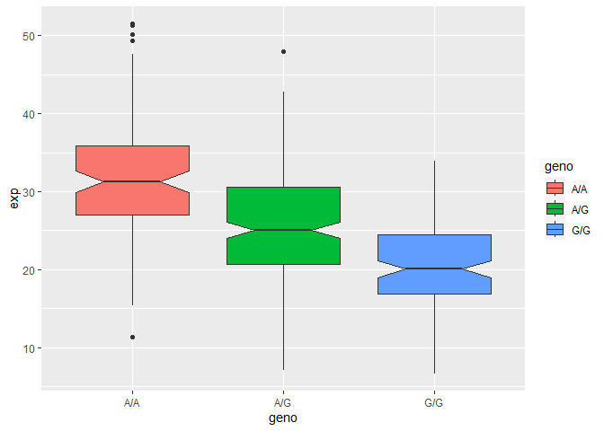

class11
================

# Section 1. Proportion of G/G in a population

Downloaded a CSV file from Ensemble

Here we read this CSV file

``` r
mxl <- read.csv("373531-SampleGenotypes-Homo_sapiens_Variation_Sample_rs8067378.csv")
head(mxl)
```

      Sample..Male.Female.Unknown. Genotype..forward.strand. Population.s. Father
    1                  NA19648 (F)                       A|A ALL, AMR, MXL      -
    2                  NA19649 (M)                       G|G ALL, AMR, MXL      -
    3                  NA19651 (F)                       A|A ALL, AMR, MXL      -
    4                  NA19652 (M)                       G|G ALL, AMR, MXL      -
    5                  NA19654 (F)                       G|G ALL, AMR, MXL      -
    6                  NA19655 (M)                       A|G ALL, AMR, MXL      -
      Mother
    1      -
    2      -
    3      -
    4      -
    5      -
    6      -

``` r
table(mxl$Genotype..forward.strand.)
```


    A|A A|G G|A G|G 
     22  21  12   9 

``` r
table(mxl$Genotype..forward.strand.)/nrow(mxl)*100
```


        A|A     A|G     G|A     G|G 
    34.3750 32.8125 18.7500 14.0625 

``` r
gbr <- read.csv("373522-SampleGenotypes-Homo_sapiens_Variation_Sample_rs8067378.csv")
head(gbr)
```

      Sample..Male.Female.Unknown. Genotype..forward.strand. Population.s. Father
    1                  HG00096 (M)                       A|A ALL, EUR, GBR      -
    2                  HG00097 (F)                       G|A ALL, EUR, GBR      -
    3                  HG00099 (F)                       G|G ALL, EUR, GBR      -
    4                  HG00100 (F)                       A|A ALL, EUR, GBR      -
    5                  HG00101 (M)                       A|A ALL, EUR, GBR      -
    6                  HG00102 (F)                       A|A ALL, EUR, GBR      -
      Mother
    1      -
    2      -
    3      -
    4      -
    5      -
    6      -

Find proportion of G\|G

``` r
round(table(gbr$Genotype..forward.strand.)/nrow(gbr)*100, 2)
```


      A|A   A|G   G|A   G|G 
    25.27 18.68 26.37 29.67 

This variant is associated with childhood asthma is frequent in the GBR
population than the MXL population. Let’s now dig into this further

## Section 4: Population scale analysis

How many samples do we have?

``` r
expr <- read.table("rs8067378_ENSG00000172057.6.txt")
head(expr)
```

       sample geno      exp
    1 HG00367  A/G 28.96038
    2 NA20768  A/G 20.24449
    3 HG00361  A/A 31.32628
    4 HG00135  A/A 34.11169
    5 NA18870  G/G 18.25141
    6 NA11993  A/A 32.89721

``` r
nrow(expr)
```

    [1] 462

``` r
table(expr$geno)
```


    A/A A/G G/G 
    108 233 121 

``` r
library(ggplot2)
```

Let’s make a boxplot

``` r
ggplot(expr)+
  aes(x=geno, y=exp, fill=geno)+
  geom_boxplot(notch = TRUE)
```



Q14: Generate a boxplot with a box per genotype, what could you infer
from the relative expression value between A/A and G/G displayed in this
plot? Does the SNP effect the expression of ORMDL3?

A\|A is expressed more than G\|G. The A\|A genotype is correlated with
more expression of ORMDL3.
