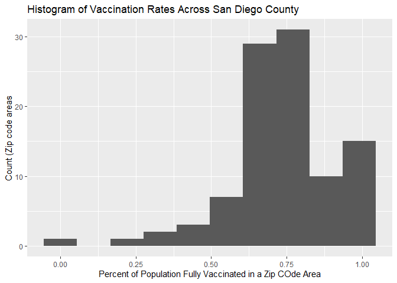
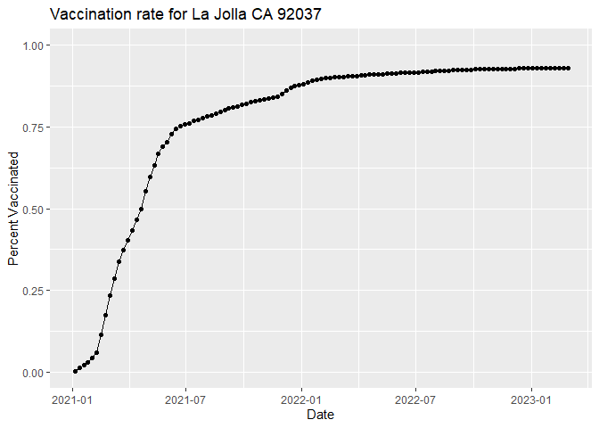
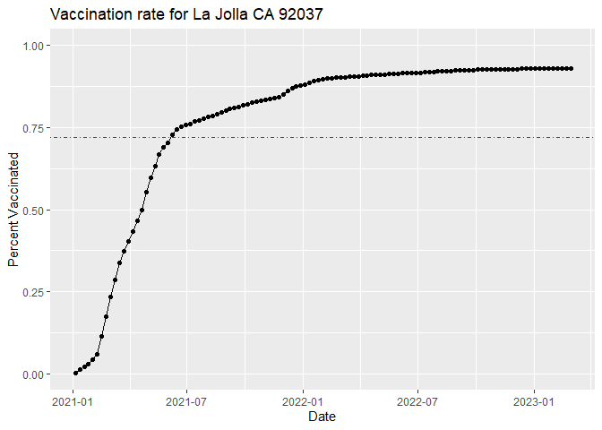
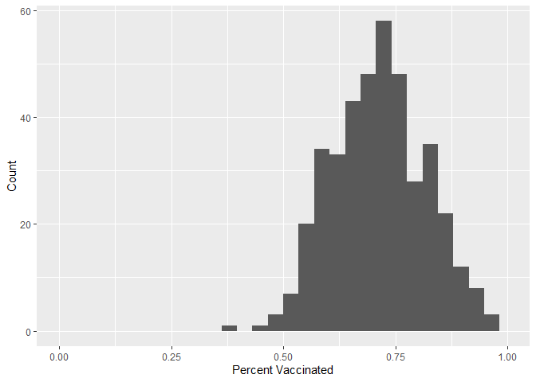
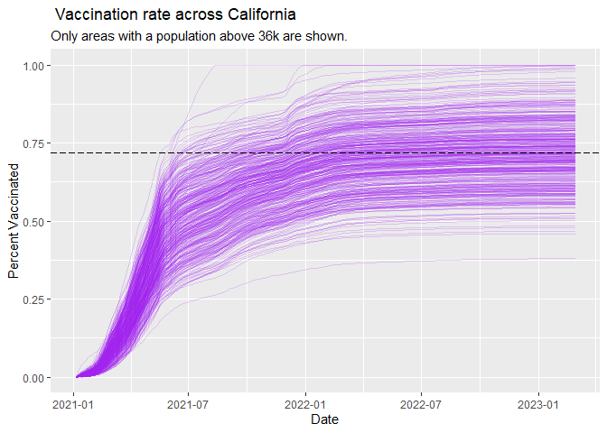

Class 17: Mini Project
================
Christina Mac

We will start by downloading the most recently dated “Statewide COVID-19
Vaccines Administered by ZIP code” CSV file:

``` r
# Import vaccination data
vax <- read.csv("covid19vaccinesbyzipcode_test.csv")
head(vax)
```

      as_of_date zip_code_tabulation_area local_health_jurisdiction    county
    1 2021-01-05                    95446                    Sonoma    Sonoma
    2 2021-01-05                    96014                  Siskiyou  Siskiyou
    3 2021-01-05                    96087                    Shasta    Shasta
    4 2021-01-05                    96008                    Shasta    Shasta
    5 2021-01-05                    95410                 Mendocino Mendocino
    6 2021-01-05                    95527                   Trinity   Trinity
      vaccine_equity_metric_quartile                 vem_source
    1                              2 Healthy Places Index Score
    2                              2    CDPH-Derived ZCTA Score
    3                              2    CDPH-Derived ZCTA Score
    4                             NA            No VEM Assigned
    5                              3    CDPH-Derived ZCTA Score
    6                              2    CDPH-Derived ZCTA Score
      age12_plus_population age5_plus_population tot_population
    1                4840.7                 5057           5168
    2                 135.0                  135            135
    3                 513.9                  544            544
    4                1125.3                 1164             NA
    5                 926.3                  988            997
    6                 476.6                  485            499
      persons_fully_vaccinated persons_partially_vaccinated
    1                       NA                           NA
    2                       NA                           NA
    3                       NA                           NA
    4                       NA                           NA
    5                       NA                           NA
    6                       NA                           NA
      percent_of_population_fully_vaccinated
    1                                     NA
    2                                     NA
    3                                     NA
    4                                     NA
    5                                     NA
    6                                     NA
      percent_of_population_partially_vaccinated
    1                                         NA
    2                                         NA
    3                                         NA
    4                                         NA
    5                                         NA
    6                                         NA
      percent_of_population_with_1_plus_dose booster_recip_count
    1                                     NA                  NA
    2                                     NA                  NA
    3                                     NA                  NA
    4                                     NA                  NA
    5                                     NA                  NA
    6                                     NA                  NA
      bivalent_dose_recip_count eligible_recipient_count
    1                        NA                        0
    2                        NA                        0
    3                        NA                        2
    4                        NA                        2
    5                        NA                        0
    6                        NA                        0
                                                                   redacted
    1 Information redacted in accordance with CA state privacy requirements
    2 Information redacted in accordance with CA state privacy requirements
    3 Information redacted in accordance with CA state privacy requirements
    4 Information redacted in accordance with CA state privacy requirements
    5 Information redacted in accordance with CA state privacy requirements
    6 Information redacted in accordance with CA state privacy requirements

Q1. What column details the total number of people fully vaccinated?
Column 11, “persons_fully_vaccinated”

Q2. What column details the Zip code tabulation area?
zip_code_tabulation_area

Q3. What is the earliest date in this dataset? 2021-01-05

``` r
head(sort(vax$as_of_date))
```

    [1] "2021-01-05" "2021-01-05" "2021-01-05" "2021-01-05" "2021-01-05"
    [6] "2021-01-05"

Q4. What is the latest date in this dataset? 2023-02-28

``` r
head(sort(vax$as_of_date, decreasing = TRUE))
```

    [1] "2023-02-28" "2023-02-28" "2023-02-28" "2023-02-28" "2023-02-28"
    [6] "2023-02-28"

We can use the skim() function for a quick overview of a new dataset
like this:

``` r
skimr::skim(vax)
```

|                                                  |        |
|:-------------------------------------------------|:-------|
| Name                                             | vax    |
| Number of rows                                   | 199332 |
| Number of columns                                | 18     |
| \_\_\_\_\_\_\_\_\_\_\_\_\_\_\_\_\_\_\_\_\_\_\_   |        |
| Column type frequency:                           |        |
| character                                        | 5      |
| numeric                                          | 13     |
| \_\_\_\_\_\_\_\_\_\_\_\_\_\_\_\_\_\_\_\_\_\_\_\_ |        |
| Group variables                                  | None   |

Data summary

**Variable type: character**

| skim_variable             | n_missing | complete_rate | min | max | empty | n_unique | whitespace |
|:--------------------------|----------:|--------------:|----:|----:|------:|---------:|-----------:|
| as_of_date                |         0 |             1 |  10 |  10 |     0 |      113 |          0 |
| local_health_jurisdiction |         0 |             1 |   0 |  15 |   565 |       62 |          0 |
| county                    |         0 |             1 |   0 |  15 |   565 |       59 |          0 |
| vem_source                |         0 |             1 |  15 |  26 |     0 |        3 |          0 |
| redacted                  |         0 |             1 |   2 |  69 |     0 |        2 |          0 |

**Variable type: numeric**

| skim_variable                              | n_missing | complete_rate |     mean |       sd |    p0 |      p25 |      p50 |      p75 |     p100 | hist  |
|:-------------------------------------------|----------:|--------------:|---------:|---------:|------:|---------:|---------:|---------:|---------:|:------|
| zip_code_tabulation_area                   |         0 |          1.00 | 93665.11 |  1817.38 | 90001 | 92257.75 | 93658.50 | 95380.50 |  97635.0 | ▃▅▅▇▁ |
| vaccine_equity_metric_quartile             |      9831 |          0.95 |     2.44 |     1.11 |     1 |     1.00 |     2.00 |     3.00 |      4.0 | ▇▇▁▇▇ |
| age12_plus_population                      |         0 |          1.00 | 18895.04 | 18993.87 |     0 |  1346.95 | 13685.10 | 31756.12 |  88556.7 | ▇▃▂▁▁ |
| age5_plus_population                       |         0 |          1.00 | 20875.24 | 21105.97 |     0 |  1460.50 | 15364.00 | 34877.00 | 101902.0 | ▇▃▂▁▁ |
| tot_population                             |      9718 |          0.95 | 23372.77 | 22628.51 |    12 |  2126.00 | 18714.00 | 38168.00 | 111165.0 | ▇▅▂▁▁ |
| persons_fully_vaccinated                   |     16525 |          0.92 | 13962.33 | 15054.09 |    11 |   930.00 |  8566.00 | 23302.00 |  87566.0 | ▇▃▁▁▁ |
| persons_partially_vaccinated               |     16525 |          0.92 |  1701.64 |  2030.18 |    11 |   165.00 |  1196.00 |  2535.00 |  39913.0 | ▇▁▁▁▁ |
| percent_of_population_fully_vaccinated     |     20825 |          0.90 |     0.57 |     0.25 |     0 |     0.42 |     0.60 |     0.74 |      1.0 | ▂▃▆▇▃ |
| percent_of_population_partially_vaccinated |     20825 |          0.90 |     0.08 |     0.09 |     0 |     0.05 |     0.06 |     0.08 |      1.0 | ▇▁▁▁▁ |
| percent_of_population_with_1\_plus_dose    |     21859 |          0.89 |     0.63 |     0.24 |     0 |     0.49 |     0.67 |     0.81 |      1.0 | ▂▂▅▇▆ |
| booster_recip_count                        |     72872 |          0.63 |  5837.31 |  7165.81 |    11 |   297.00 |  2748.00 |  9438.25 |  59553.0 | ▇▂▁▁▁ |
| bivalent_dose_recip_count                  |    158664 |          0.20 |  2924.93 |  3583.45 |    11 |   190.00 |  1418.00 |  4626.25 |  27458.0 | ▇▂▁▁▁ |
| eligible_recipient_count                   |         0 |          1.00 | 12801.84 | 14908.33 |     0 |   504.00 |  6338.00 | 21973.00 |  87234.0 | ▇▃▁▁▁ |

Q5. How many numeric columns are in this dataset? 13

Q6. Note that there are “missing values” in the dataset. How many NA
values there in the persons_fully_vaccinated column? 16525

``` r
sum(is.na(vax$persons_fully_vaccinated))
```

    [1] 16525

What percent of persons_fully_vaccinated values are missing (to 2
significant figures)? 8.3%

``` r
length(vax$persons_fully_vaccinated)
```

    [1] 199332

``` r
round((sum(is.na(vax$persons_fully_vaccinated))/length(vax$persons_fully_vaccinated))*100, 2)
```

    [1] 8.29

\##Working with dates

the lubridate package makes working with dates and times in R much less
of a pain. Let’s have a first play with this package here.

``` r
library(lubridate)
```


    Attaching package: 'lubridate'

    The following objects are masked from 'package:base':

        date, intersect, setdiff, union

``` r
today()
```

    [1] "2023-03-16"

``` r
# This will give an Error!
#today() - vax$as_of_date[1]
```

``` r
# Specify that we are using the year-month-day format
vax$as_of_date <- ymd(vax$as_of_date)
```

We can now magically do math with dates

``` r
today()-ymd("2021-01-05")
```

    Time difference of 800 days

How old am I?

``` r
today()-ymd("2001-02-11")
```

    Time difference of 8068 days

Let’s treat the whole col

How many days have passed since the first vaccination reported in this
dataset?

``` r
today()-ymd(vax$as_of_date[1])
```

    Time difference of 800 days

``` r
vax$as_of_date[nrow(vax)] - vax$as_of_date[1]
```

    Time difference of 784 days

Q9. How many days have passed since the last update of the dataset? 7
days

``` r
today()-ymd(vax$as_of_date[nrow(vax)])
```

    Time difference of 16 days

Q10. How many unique dates are in the dataset (i.e. how many different
dates are detailed)? 113 dates

``` r
length(unique(vax$as_of_date))
```

    [1] 113

# Working with ZIP codes

ZIP codes are also rather annoying things to work with as they are
nmeric but no in the conventional sense of doing math.

Just like dates we have speial packages to help us work with ZIP codes.

``` r
library(zipcodeR)
```

``` r
geocode_zip('92037')
```

    # A tibble: 1 × 3
      zipcode   lat   lng
      <chr>   <dbl> <dbl>
    1 92037    32.8 -117.

``` r
zip_distance('92037','95148')
```

      zipcode_a zipcode_b distance
    1     92037     95148    405.6

``` r
reverse_zipcode(c('92037', "95148") )
```

    # A tibble: 2 × 24
      zipcode zipcode_…¹ major…² post_…³ common_c…⁴ county state   lat   lng timez…⁵
      <chr>   <chr>      <chr>   <chr>       <blob> <chr>  <chr> <dbl> <dbl> <chr>  
    1 92037   Standard   La Jol… La Jol… <raw 20 B> San D… CA     32.8 -117. Pacific
    2 95148   Standard   San Jo… San Jo… <raw 20 B> Santa… CA     37.3 -122. Pacific
    # … with 14 more variables: radius_in_miles <dbl>, area_code_list <blob>,
    #   population <int>, population_density <dbl>, land_area_in_sqmi <dbl>,
    #   water_area_in_sqmi <dbl>, housing_units <int>,
    #   occupied_housing_units <int>, median_home_value <int>,
    #   median_household_income <int>, bounds_west <dbl>, bounds_east <dbl>,
    #   bounds_north <dbl>, bounds_south <dbl>, and abbreviated variable names
    #   ¹​zipcode_type, ²​major_city, ³​post_office_city, ⁴​common_city_list, …

# Focus on the San Diego area

Let’s now focus on the San Diego county

``` r
# Subset to San Diego county only areas
sd <- vax[ vax$county == "San Diego" , ]
```

``` r
library(dplyr)
```


    Attaching package: 'dplyr'

    The following objects are masked from 'package:stats':

        filter, lag

    The following objects are masked from 'package:base':

        intersect, setdiff, setequal, union

``` r
sd <- filter(vax, county == "San Diego")

nrow(sd)
```

    [1] 12091

``` r
sd.10 <- filter(vax, county == "San Diego" &
                age5_plus_population > 10000)
```

``` r
head(sd.10)
```

      as_of_date zip_code_tabulation_area local_health_jurisdiction    county
    1 2021-01-05                    92040                 San Diego San Diego
    2 2021-01-05                    92154                 San Diego San Diego
    3 2021-01-05                    92122                 San Diego San Diego
    4 2021-01-05                    92120                 San Diego San Diego
    5 2021-01-05                    92115                 San Diego San Diego
    6 2021-01-05                    92114                 San Diego San Diego
      vaccine_equity_metric_quartile                 vem_source
    1                              3 Healthy Places Index Score
    2                              2 Healthy Places Index Score
    3                              4 Healthy Places Index Score
    4                              4 Healthy Places Index Score
    5                              2 Healthy Places Index Score
    6                              2 Healthy Places Index Score
      age12_plus_population age5_plus_population tot_population
    1               39405.0                42833          46306
    2               76365.2                82971          88979
    3               44091.1                45951          48071
    4               26372.9                28414          30550
    5               56152.4                60409          64343
    6               59050.7                64945          68851
      persons_fully_vaccinated persons_partially_vaccinated
    1                       14                          585
    2                       16                         1397
    3                       19                         1249
    4                       25                          906
    5                       28                          874
    6                       12                         1213
      percent_of_population_fully_vaccinated
    1                               0.000302
    2                               0.000180
    3                               0.000395
    4                               0.000818
    5                               0.000435
    6                               0.000174
      percent_of_population_partially_vaccinated
    1                                   0.012633
    2                                   0.015700
    3                                   0.025982
    4                                   0.029656
    5                                   0.013583
    6                                   0.017618
      percent_of_population_with_1_plus_dose booster_recip_count
    1                               0.012935                  NA
    2                               0.015880                  NA
    3                               0.026377                  NA
    4                               0.030474                  NA
    5                               0.014018                  NA
    6                               0.017792                  NA
      bivalent_dose_recip_count eligible_recipient_count
    1                        NA                       14
    2                        NA                       16
    3                        NA                       19
    4                        NA                       25
    5                        NA                       28
    6                        NA                       12
                                                                   redacted
    1 Information redacted in accordance with CA state privacy requirements
    2 Information redacted in accordance with CA state privacy requirements
    3 Information redacted in accordance with CA state privacy requirements
    4 Information redacted in accordance with CA state privacy requirements
    5 Information redacted in accordance with CA state privacy requirements
    6 Information redacted in accordance with CA state privacy requirements

Q11. How many distinct zip codes are listed for San Diego County? 107
zipcodes

``` r
length(unique(sd$zip_code_tabulation_area))
```

    [1] 107

Q12. What San Diego County Zip code area has the largest 12 + Population
in this dataset? 92154

``` r
sd$zip_code_tabulation_area[which.max(sd$age12_plus_population)]
```

    [1] 92154

``` r
x <-sd %>%
  filter(as_of_date == "2023-02-28")
```

Q13. What is the overall average “Percent of Population Fully
Vaccinated” value for all San Diego “County” as of “2022-02-28”? 74%

``` r
sd.today <- filter(sd, as_of_date == "2023-02-28")
```

``` r
mean(sd.today$percent_of_population_fully_vaccinated, na.rm = T)
```

    [1] 0.7400878

Q14. Using either ggplot or base R graphics make a summary figure that
shows the distribution of Percent of Population Fully Vaccinated values
as of “2022-02-28”?

``` r
library(ggplot2)
```

``` r
ggplot(sd.today, aes(x=sd.today$percent_of_population_fully_vaccinated, )) + 
  geom_histogram(bins = 10, na.rm=T) +
  labs(x= "Percent of Population Fully Vaccinated in a Zip COde Area", y="Count (Zip code areas") +
  ggtitle("Histogram of Vaccination Rates Across San Diego County")
```

    Warning: Use of `sd.today$percent_of_population_fully_vaccinated` is discouraged.
    ℹ Use `percent_of_population_fully_vaccinated` instead.



``` r
ucsd <- filter(sd, zip_code_tabulation_area=="92037")
ucsd[1,]$age5_plus_population
```

    [1] 36144

Q15. Using ggplot make a graph of the vaccination rate time course for
the 92037 ZIP code area:

``` r
ggplot(ucsd) +
  aes(x=as_of_date,
      y=percent_of_population_fully_vaccinated) +
  geom_point() +
  geom_line(group=1) +
  ylim(c(0,1)) +
  labs(title = "Vaccination rate for La Jolla CA 92037", x= "Date", y="Percent Vaccinated")
```



``` r
# Subset to all CA areas with a population as large as 92037
vax.36 <- filter(vax, age5_plus_population > 36144 &
                as_of_date == "2022-11-15")

head(vax.36)
```

      as_of_date zip_code_tabulation_area local_health_jurisdiction         county
    1 2022-11-15                    90022               Los Angeles    Los Angeles
    2 2022-11-15                    92346            San Bernardino San Bernardino
    3 2022-11-15                    92231                  Imperial       Imperial
    4 2022-11-15                    95404                    Sonoma         Sonoma
    5 2022-11-15                    92253                 Riverside      Riverside
    6 2022-11-15                    92345            San Bernardino San Bernardino
      vaccine_equity_metric_quartile                 vem_source
    1                              1 Healthy Places Index Score
    2                              2 Healthy Places Index Score
    3                              1 Healthy Places Index Score
    4                              3 Healthy Places Index Score
    5                              3 Healthy Places Index Score
    6                              1 Healthy Places Index Score
      age12_plus_population age5_plus_population tot_population
    1               55192.3                62369          67014
    2               52408.8                58874          63857
    3               32448.6                36867          40064
    4               35138.9                38436          40497
    5               35435.2                38922          40929
    6               66047.5                75539          82110
      persons_fully_vaccinated persons_partially_vaccinated
    1                    49419                         5537
    2                    34564                         3266
    3                    70739                        38805
    4                    30573                         2342
    5                    27448                         3453
    6                    41672                         4283
      percent_of_population_fully_vaccinated
    1                               0.737443
    2                               0.541272
    3                               1.000000
    4                               0.754945
    5                               0.670625
    6                               0.507514
      percent_of_population_partially_vaccinated
    1                                   0.082625
    2                                   0.051146
    3                                   0.968575
    4                                   0.057831
    5                                   0.084366
    6                                   0.052162
      percent_of_population_with_1_plus_dose booster_recip_count
    1                               0.820068               21942
    2                               0.592418               16624
    3                               1.000000               26706
    4                               0.812776               17977
    5                               0.754991               14896
    6                               0.559676               16576
      bivalent_dose_recip_count eligible_recipient_count redacted
    1                      4061                    49392       No
    2                      3818                    34542       No
    3                      2737                    70617       No
    4                      7156                    30525       No
    5                      4804                    27434       No
    6                      3191                    41649       No

Q16. Calculate the mean “Percent of Population Fully Vaccinated” for ZIP
code areas with a population as large as 92037 (La Jolla) as_of_date
“2022-11-15”. Add this as a straight horizontal line to your plot from
above with the geom_hline() function?

``` r
average_percent <- mean(vax.36$percent_of_population_fully_vaccinated)
```

``` r
ggplot(ucsd) +
  aes(x=as_of_date,
      y=percent_of_population_fully_vaccinated) +
  geom_point() +
  geom_line(group=1) +
  ylim(c(0,1)) +
  labs(title = "Vaccination rate for La Jolla CA 92037", x= "Date", y="Percent Vaccinated") +
  geom_hline(yintercept = average_percent,color = "red", linetype=10)
```



Q17. What is the 6 number summary (Min, 1st Qu., Median, Mean, 3rd Qu.,
and Max) of the “Percent of Population Fully Vaccinated” values for ZIP
code areas with a population as large as 92037 (La Jolla) as_of_date
“2022-11-15”?

``` r
summary(vax.36$percent_of_population_fully_vaccinated)
```

       Min. 1st Qu.  Median    Mean 3rd Qu.    Max. 
     0.3784  0.6444  0.7162  0.7191  0.7882  1.0000 

Q18. Using ggplot generate a histogram of this data.

``` r
ggplot(vax.36) +
  aes(x=percent_of_population_fully_vaccinated) +
  geom_histogram() +
  labs(x= "Percent Vaccinated", y="Count") +
  xlim(0,1)
```

    `stat_bin()` using `bins = 30`. Pick better value with `binwidth`.

    Warning: Removed 2 rows containing missing values (`geom_bar()`).



Q19. Is the 92109 and 92040 ZIP code areas above or below the average
value you calculated for all these above? Both averages are lower

``` r
x <- filter(vax.36, zip_code_tabulation_area %in% c("92109", "92040"))
x$percent_of_population_fully_vaccinated
```

    [1] 0.548849 0.692874

``` r
vax %>% filter(as_of_date == "2022-11-15") %>%  
  filter(zip_code_tabulation_area=="92040") %>%
  select(percent_of_population_fully_vaccinated)
```

      percent_of_population_fully_vaccinated
    1                               0.548849

``` r
vax.36.all <- filter(vax,age5_plus_population > 36144)


ggplot(vax.36.all) +
  aes(as_of_date,
      percent_of_population_fully_vaccinated, 
      group=zip_code_tabulation_area) +
  geom_line(alpha=0.2, color="purple", na.rm = T) +
  ylim(0,1) +
  labs(x="Date", y="Percent Vaccinated",
       title= " Vaccination rate across California",
       subtitle="Only areas with a population above 36k are shown.") +
  geom_hline(yintercept = average_percent, linetype=5)
```



Q21. How do you feel about traveling for Thanksgiving Break and meeting
for in-person class afterwards? Would be tiring, but I would be okay
with it!
